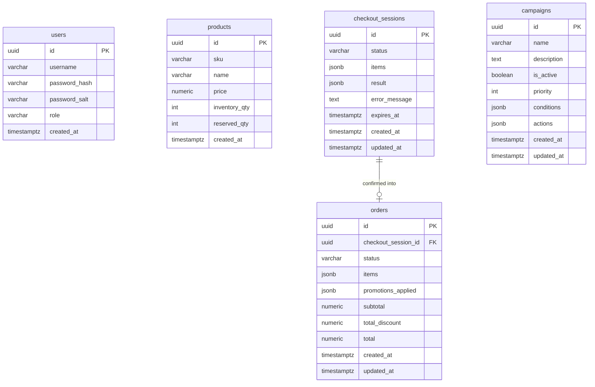
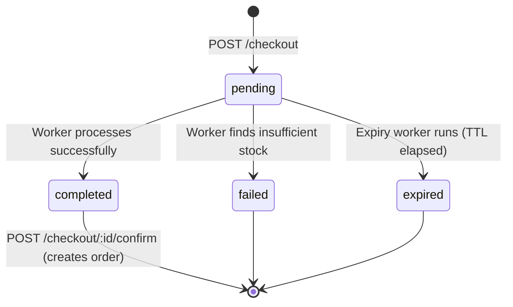
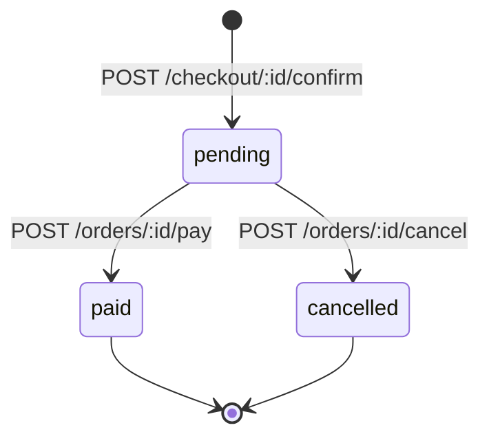

# Database Design

ForteCommerce uses **PostgreSQL 16** as its primary database. This document covers the full schema, table relationships, index strategy, JSONB column structures, and seed data.

---

## Table of Contents

- [Overview](#overview)
- [Entity Relationship Diagram](#entity-relationship-diagram)
- [Tables](#tables)
  - [users](#users)
  - [products](#products)
  - [checkout_sessions](#checkout_sessions)
  - [orders](#orders)
  - [campaigns](#campaigns)
- [JSONB Column Structures](#jsonb-column-structures)
  - [checkout_sessions.items](#checkout_sessionssitems)
  - [checkout_sessions.result](#checkout_sessionsresult)
  - [orders.items](#ordersitems)
  - [orders.promotions_applied](#orderspromotions_applied)
  - [campaigns.conditions](#campaignsconditions)
  - [campaigns.actions](#campaignsactions)
- [Indexes](#indexes)
- [Migrations](#migrations)
- [Seed Data](#seed-data)
- [Key Design Decisions](#key-design-decisions)

---

## Overview

| Table | Purpose | Row Growth |
|-------|---------|-----------|
| `users` | Authentication and role management | Low — manual registration |
| `products` | Product catalog with inventory tracking | Low–Medium |
| `checkout_sessions` | Async checkout state machine | High — one per checkout attempt |
| `orders` | Confirmed purchases | Medium — one per confirmed checkout |
| `campaigns` | Promotion rules (conditions + actions) | Low — managed by sellers |

All primary keys are **UUID v4**. All timestamps use **TIMESTAMPTZ** (UTC stored, timezone-aware).

---

## Entity Relationship Diagram



---

## Tables

### `users`

Stores credentials and role assignments. Passwords are hashed with **bcrypt (cost 12)** applied to `sha256(password + salt)`.

```sql
CREATE TABLE users (
    id            UUID         PRIMARY KEY DEFAULT uuid_generate_v4(),
    username      VARCHAR(50)  UNIQUE NOT NULL,
    password_hash VARCHAR(255) NOT NULL,
    password_salt VARCHAR(64)  NOT NULL,
    role          VARCHAR(20)  NOT NULL DEFAULT 'buyer',
    created_at    TIMESTAMPTZ  NOT NULL DEFAULT NOW()
);
```

| Column | Type | Constraints | Description |
|--------|------|-------------|-------------|
| `id` | UUID | PK, auto-generated | Unique identifier |
| `username` | VARCHAR(50) | UNIQUE, NOT NULL | Login handle |
| `password_hash` | VARCHAR(255) | NOT NULL | bcrypt hash of `sha256(password + salt)` |
| `password_salt` | VARCHAR(64) | NOT NULL | 64-char hex salt, unique per user |
| `role` | VARCHAR(20) | NOT NULL, DEFAULT `buyer` | `buyer` or `seller` |
| `created_at` | TIMESTAMPTZ | NOT NULL, DEFAULT NOW() | Account creation timestamp |

**Role values:**

| Value | Description |
|-------|-------------|
| `buyer` | Can browse products, checkout, and manage their orders |
| `seller` | Can manage products and campaigns (plus all buyer capabilities) |

---

### `products`

Product catalog with real-time inventory tracking via two counters.

```sql
CREATE TABLE products (
    id            UUID          PRIMARY KEY DEFAULT uuid_generate_v4(),
    sku           VARCHAR(50)   UNIQUE NOT NULL,
    name          VARCHAR(255)  NOT NULL,
    price         NUMERIC(10,2) NOT NULL,
    inventory_qty INT           NOT NULL DEFAULT 0,
    reserved_qty  INT           NOT NULL DEFAULT 0,
    created_at    TIMESTAMPTZ   NOT NULL DEFAULT NOW()
);
```

| Column | Type | Constraints | Description |
|--------|------|-------------|-------------|
| `id` | UUID | PK, auto-generated | Unique identifier |
| `sku` | VARCHAR(50) | UNIQUE, NOT NULL | Stock Keeping Unit — business identifier |
| `name` | VARCHAR(255) | NOT NULL | Display name |
| `price` | NUMERIC(10,2) | NOT NULL | Unit price, max 99,999,999.99 |
| `inventory_qty` | INT | NOT NULL, DEFAULT 0 | Total physical stock |
| `reserved_qty` | INT | NOT NULL, DEFAULT 0 | Units locked by active checkout sessions |
| `created_at` | TIMESTAMPTZ | NOT NULL, DEFAULT NOW() | Created timestamp |

**Inventory model:**

```
available_qty = inventory_qty - reserved_qty
```

| Event | inventory_qty | reserved_qty |
|-------|:---:|:---:|
| Seller adds stock | +N | — |
| Checkout submitted (reserved) | — | +N |
| Checkout confirmed (order created) | −N | −N |
| Checkout expired (released) | — | −N |
| Order cancelled (restored) | +N | — |

> `reserved_qty` acts as a soft lock — it prevents overselling during the async checkout window without immediately decrementing physical inventory.

---

### `checkout_sessions`

Tracks the lifecycle of each async checkout attempt. Created on `POST /checkout`, processed asynchronously via RabbitMQ, and polled by the client until terminal state.

```sql
CREATE TABLE checkout_sessions (
    id            UUID         PRIMARY KEY DEFAULT uuid_generate_v4(),
    status        VARCHAR(20)  NOT NULL DEFAULT 'pending',
    items         JSONB        NOT NULL,
    result        JSONB,
    error_message TEXT,
    expires_at    TIMESTAMPTZ  NOT NULL,
    created_at    TIMESTAMPTZ  NOT NULL DEFAULT NOW(),
    updated_at    TIMESTAMPTZ  NOT NULL DEFAULT NOW()
);
```

| Column | Type | Constraints | Description |
|--------|------|-------------|-------------|
| `id` | UUID | PK | Session identifier, returned to client on submit |
| `status` | VARCHAR(20) | NOT NULL | State machine status (see below) |
| `items` | JSONB | NOT NULL | Input: map of `sku → qty` |
| `result` | JSONB | nullable | Output: computed cart with promotions applied |
| `error_message` | TEXT | nullable | Set when `status = failed` |
| `expires_at` | TIMESTAMPTZ | NOT NULL | Session TTL — 15 minutes from creation |
| `created_at` | TIMESTAMPTZ | NOT NULL | — |
| `updated_at` | TIMESTAMPTZ | NOT NULL | Updated on every status transition |

**Status state machine:**



| Status | Description | result | error_message |
|--------|-------------|--------|---------------|
| `pending` | Queued, waiting for worker | null | null |
| `completed` | Processed, ready to confirm | populated | null |
| `failed` | Processing failed (e.g. stock ran out) | null | populated |
| `expired` | TTL elapsed before confirmation | null | null |

---

### `orders`

Confirmed purchases created from a completed checkout session. Snapshot of all pricing at the time of confirmation — no foreign key to `products` to allow product changes post-order.

```sql
CREATE TABLE orders (
    id                  UUID          PRIMARY KEY DEFAULT uuid_generate_v4(),
    checkout_session_id UUID          NOT NULL REFERENCES checkout_sessions(id),
    status              VARCHAR(20)   NOT NULL DEFAULT 'pending',
    items               JSONB         NOT NULL,
    promotions_applied  JSONB         NOT NULL DEFAULT '[]',
    subtotal            NUMERIC(10,2) NOT NULL,
    total_discount      NUMERIC(10,2) NOT NULL DEFAULT 0,
    total               NUMERIC(10,2) NOT NULL,
    created_at          TIMESTAMPTZ   NOT NULL DEFAULT NOW(),
    updated_at          TIMESTAMPTZ   NOT NULL DEFAULT NOW()
);
```

| Column | Type | Constraints | Description |
|--------|------|-------------|-------------|
| `id` | UUID | PK | Order identifier |
| `checkout_session_id` | UUID | FK → `checkout_sessions.id`, UNIQUE | One order per checkout session |
| `status` | VARCHAR(20) | NOT NULL | `pending`, `paid`, or `cancelled` |
| `items` | JSONB | NOT NULL | Snapshot of cart items at confirmation time |
| `promotions_applied` | JSONB | NOT NULL, DEFAULT `[]` | Snapshot of applied promotions |
| `subtotal` | NUMERIC(10,2) | NOT NULL | Sum of `price × qty` before discounts |
| `total_discount` | NUMERIC(10,2) | NOT NULL | Sum of all promotion discounts |
| `total` | NUMERIC(10,2) | NOT NULL | `subtotal − total_discount` |
| `created_at` | TIMESTAMPTZ | NOT NULL | — |
| `updated_at` | TIMESTAMPTZ | NOT NULL | — |

**Status transitions:**



> Cancelling an order restores `inventory_qty` on all ordered products.

---

### `campaigns`

Promotion rules defined by sellers. Each campaign has a list of conditions (all must match) and a list of actions (all applied when matched). Evaluated by the checkout worker in priority order.

```sql
CREATE TABLE campaigns (
    id          UUID         PRIMARY KEY DEFAULT gen_random_uuid(),
    name        VARCHAR(255) NOT NULL,
    description TEXT         NOT NULL DEFAULT '',
    is_active   BOOLEAN      NOT NULL DEFAULT true,
    priority    INT          NOT NULL DEFAULT 0,
    conditions  JSONB        NOT NULL DEFAULT '[]',
    actions     JSONB        NOT NULL DEFAULT '[]',
    created_at  TIMESTAMPTZ  NOT NULL DEFAULT NOW(),
    updated_at  TIMESTAMPTZ  NOT NULL DEFAULT NOW()
);
```

| Column | Type | Constraints | Description |
|--------|------|-------------|-------------|
| `id` | UUID | PK | Campaign identifier |
| `name` | VARCHAR(255) | NOT NULL | Display name |
| `description` | TEXT | NOT NULL | Human-readable description |
| `is_active` | BOOLEAN | NOT NULL, DEFAULT true | Soft enable/disable without deletion |
| `priority` | INT | NOT NULL, DEFAULT 0 | Higher value = evaluated first |
| `conditions` | JSONB | NOT NULL | Array of condition objects (AND logic) |
| `actions` | JSONB | NOT NULL | Array of action objects (all applied on match) |
| `created_at` | TIMESTAMPTZ | NOT NULL | — |
| `updated_at` | TIMESTAMPTZ | NOT NULL | — |

---

## JSONB Column Structures

### `checkout_sessions.items`

Input SKUs from the client, aggregated into a `sku → qty` map.

```json
{
  "120P90": 3,
  "43N23P": 1
}
```

### `checkout_sessions.result`

Computed by the checkout worker after inventory validation and promotion application.

```json
{
  "items": [
    { "sku": "120P90", "name": "Google Home", "qty": 3, "price": 49.99, "total": 149.97 },
    { "sku": "43N23P", "name": "MacBook Pro",  "qty": 1, "price": 5399.99, "total": 5399.99 }
  ],
  "promotions_applied": [
    { "name": "Google Home Bundle (3 for 2)", "description": "Buy 3, pay for 2", "discount": 49.99 }
  ],
  "subtotal": 5549.96,
  "total_discount": 49.99,
  "total": 5499.97
}
```

### `orders.items`

Snapshot copied from `checkout_sessions.result.items` at confirmation time. Immutable after creation.

```json
[
  { "sku": "120P90", "name": "Google Home", "qty": 3, "price": 49.99, "total": 149.97 }
]
```

### `orders.promotions_applied`

Snapshot copied from `checkout_sessions.result.promotions_applied`. Immutable after creation.

```json
[
  { "name": "Google Home Bundle (3 for 2)", "description": "Buy 3 Google Home units, pay for only 2", "discount": 49.99 }
]
```

### `campaigns.conditions`

Array of condition objects. **All conditions must be satisfied** (AND logic) for the campaign to apply.

```json
[
  { "type": "item_qty_gte", "sku": "120P90", "qty": 3 }
]
```

| Condition `type` | Fields used | Description |
|------------------|-------------|-------------|
| `cart_has_sku` | `sku`, `min_qty` | Cart must contain `sku` with at least `min_qty` units |
| `item_qty_gte` | `sku`, `qty` | Specific `sku` quantity in cart ≥ `qty` |
| `cart_total_gte` | `amount` | Cart subtotal (before discounts) ≥ `amount` |
| `cart_item_count_gte` | `count` | Number of unique SKUs in cart ≥ `count` |

### `campaigns.actions`

Array of action objects. **All actions are applied** when conditions match.

```json
[
  { "type": "buy_n_get_m", "sku": "120P90", "buy_n": 3, "pay_m": 2 }
]
```

| Action `type` | Fields used | Description |
|---------------|-------------|-------------|
| `free_item` | `sku`, `trigger_sku` | Get `sku` for free when `trigger_sku` is in cart |
| `buy_n_get_m` | `sku`, `buy_n`, `pay_m` | Buy `buy_n` of `sku`, pay price of only `pay_m` units |
| `pct_discount_on_sku` | `sku`, `pct` | `pct`% off all units of `sku` |
| `pct_discount_on_cart` | `pct` | `pct`% off the entire cart subtotal |
| `fixed_discount` | `amount` | Fixed `amount` deducted from cart total |

---

## Indexes

| Index | Table | Columns | Type | Purpose |
|-------|-------|---------|------|---------|
| `idx_products_sku` | `products` | `sku` | UNIQUE | Fast product lookup by SKU during checkout |
| `idx_checkout_sessions_status_expires` | `checkout_sessions` | `(status, expires_at)` WHERE `status = 'pending'` | Partial | Expiry worker query — only scans pending rows |
| `idx_orders_checkout_session_id` | `orders` | `checkout_session_id` | UNIQUE | Enforces one order per checkout session; fast join |
| `idx_campaigns_active_priority` | `campaigns` | `(is_active, priority)` | Composite | Checkout worker fetches active campaigns sorted by priority |

---

## Migrations

Migrations are managed with [goose](https://github.com/pressly/goose). Files live in `backend/migrations/`.

| File | Description |
|------|-------------|
| `001_init.sql` | Creates `users`, `products`, `checkout_sessions`, `orders` + indexes |
| `002_seed.sql` | Seeds demo users (`admin`, `demo1`–`demo4`) and 4 demo products |
| `003_add_role.sql` | Adds `role` column to `users`; seeds `seller1` account |
| `004_campaigns.sql` | Creates `campaigns` table + index; seeds 3 demo campaigns |

```bash
make migrate-up       # apply all pending migrations
make migrate-down     # roll back last migration
make migrate-status   # show current migration state
```

---

## Seed Data

### Users

| Username | Password | Role |
|----------|----------|------|
| `admin` | `admin123` | buyer |
| `demo1` | `demo1` | buyer |
| `demo2` | `demo2` | buyer |
| `demo3` | `demo3` | buyer |
| `demo4` | `demo4` | buyer |
| `seller1` | `seller1` | seller |

> Passwords are bcrypt-hashed (cost 12) with a zero salt in seed data. **Do not use these accounts in production.**

### Products

| SKU | Name | Price | Stock |
|-----|------|-------|-------|
| `120P90` | Google Home | $49.99 | 10 |
| `43N23P` | MacBook Pro | $5,399.99 | 5 |
| `A304SD` | Alexa Speaker | $109.50 | 10 |
| `234234` | Raspberry Pi B | $30.00 | 2 |

### Campaigns

| Name | Condition | Action | Priority |
|------|-----------|--------|----------|
| MacBook Pro Free Raspberry Pi | Cart has MacBook Pro AND Raspberry Pi | Give Raspberry Pi free | 10 |
| Google Home Bundle (3 for 2) | Buy ≥3 Google Home | Buy 3, pay for 2 | 20 |
| Alexa Speaker 10% Discount | Buy ≥3 Alexa Speakers | 10% off all Alexa Speakers | 30 |

---

## Key Design Decisions

### Why JSONB for `items`, `result`, and `promotions_applied`?

Order and checkout data is a **point-in-time snapshot**. Using JSONB instead of normalized foreign keys ensures:
- Price and promotion data is preserved even if a product is later updated or deleted
- No join complexity when reading order history
- Schema flexibility for future fields without migrations

### Why two inventory counters (`inventory_qty` + `reserved_qty`)?

The async checkout flow introduces a window between "user submits checkout" and "user confirms order" (up to 15 minutes). During this window:
- `reserved_qty` tracks units locked by pending checkout sessions — prevents overselling
- `inventory_qty` is only decremented on confirmed order — represents true committed stock
- If checkout expires or fails, only `reserved_qty` is released — no inventory change needed

### Why a partial index on `checkout_sessions`?

```sql
CREATE INDEX idx_checkout_sessions_status_expires
  ON checkout_sessions(status, expires_at)
  WHERE status = 'pending';
```

The expiry worker runs every 60 seconds and only queries `status = 'pending'` rows. A partial index covers only that subset, keeping it small and fast as the table grows with completed/expired sessions.

### Why UNIQUE on `orders.checkout_session_id`?

Enforces at the database level that a checkout session can only be confirmed once. Even if the confirm endpoint is called multiple times concurrently, only one insert will succeed — the rest will hit a unique constraint violation.

### Why is `campaigns` evaluated in priority order?

Higher-priority campaigns are applied first. This allows sellers to define precedence when multiple promotions could apply to the same cart. All matching campaigns are applied (not just the highest-priority one), but the order matters when one action affects the cart total that another condition checks against.
